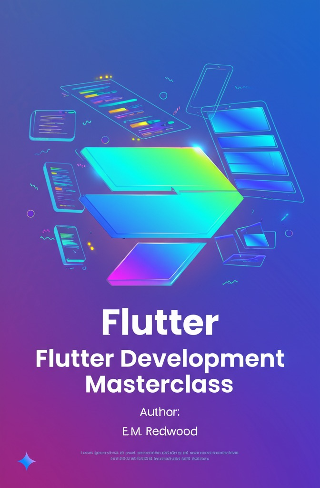

# Flutter Development Masterclass: Build Cross-Platform Apps in 2025

## Book Overview

### Introduction

"Flutter Development Masterclass" is a comprehensive, cutting-edge guide that takes developers from Flutter basics to advanced application development. Written by an industry expert with years of production Flutter experience, this book distills the most effective patterns and practices that have emerged from Flutter's evolution through 2025.

### Who This Book Is For

This book serves multiple audiences effectively:

- Beginners with basic programming knowledge who want to enter mobile development
- Web developers looking to expand into mobile and cross-platform applications
- Native iOS and Android developers seeking a more efficient cross-platform solution
- Professional developers who need a complete reference for modern Flutter development

### What Makes This Book Different

Unlike many programming books that focus solely on API documentation or basic tutorials, "Flutter Development Masterclass" takes a project-based approach. Readers build complete, production-quality applications from scratch, facing the same challenges they'll encounter in real-world development. Each chapter introduces new concepts while reinforcing previous learning, creating a cumulative learning experience.

### Chapter Breakdown

The book follows a carefully crafted learning path:

1. **Introduction to Flutter** - Core concepts, development environment setup, and your first app
2. **Dart Essentials** - Everything you need to know about Flutter's programming language
3. **Flutter Widgets and UI Building** - Master Flutter's rich widget ecosystem and composition model
4. **Responsive and Adaptive Design** - Create interfaces that work beautifully across all screen sizes and platforms
5. **State Management** - Explore various approaches to managing application state effectively
6. **Navigation and Routing** - Implement sophisticated navigation patterns for multi-screen apps
7. **Theming and Styling** - Create consistent, beautiful visual experiences
8. **Flutter Animations** - Bring your UI to life with engaging, smooth animations
9. **Hardware Integration** - Access device capabilities like camera, location, and sensors
10. **Backend Integration** - Connect your app to cloud services, APIs, and databases
11. **App Deployment** - Navigate the app store submission process and prepare for production
12. **Architecting for Scale** - Design patterns and architecture for enterprise-level Flutter apps
13. **Flutter Testing** - Comprehensive testing strategies to ensure app quality
14. **Internationalization and Localization** - Make your app accessible to users worldwide
15. **Flutter Animations Advanced** - Create complex, coordinated animations and transitions
16. **Accessibility** - Ensure your app can be used by everyone, regardless of ability

### Key Features

- **Complete Code Examples**: Every concept is illustrated with production-ready code
- **Real-World Projects**: Build practical applications that solve genuine user needs
- **2025 Best Practices**: Incorporates the latest Flutter patterns and techniques
- **Performance Optimization**: Learn how to create blazing-fast Flutter applications
- **Troubleshooting Guides**: Master debugging techniques for common Flutter challenges
- **Design Patterns**: Applied examples of architectural patterns in Flutter contexts

### Why Flutter Matters in 2025

Flutter has evolved from a promising framework to the industry standard for cross-platform development. Major companies worldwide have adopted Flutter for mission-critical applications, recognizing its unique combination of development speed and user experience quality. By mastering Flutter, developers can:

- Build for iOS, Android, web, desktop, and embedded devices from a single codebase
- Dramatically reduce development time and maintenance costs
- Create custom, pixel-perfect interfaces without platform limitations
- Deliver native-like performance across all target platforms
- Leverage a mature ecosystem of packages and plugins
- Future-proof their skills in an increasingly cross-platform world

### What Readers Will Accomplish

By the end of this book, readers will have:

- Built multiple complete Flutter applications from scratch
- Mastered Flutter's widget system and state management approaches
- Developed skills to architect scalable, maintainable Flutter applications
- Gained confidence to tackle complex UI challenges with elegant solutions
- Learned to optimize Flutter apps for performance across platforms
- Acquired the ability to implement advanced features like animations and hardware integration
- Prepared apps for international markets with localization
- Made their applications accessible to all users

"Flutter Development Masterclass" is more than just a programming book—it's a complete professional development resource that will serve as both a learning tool and a reference for years to come.
